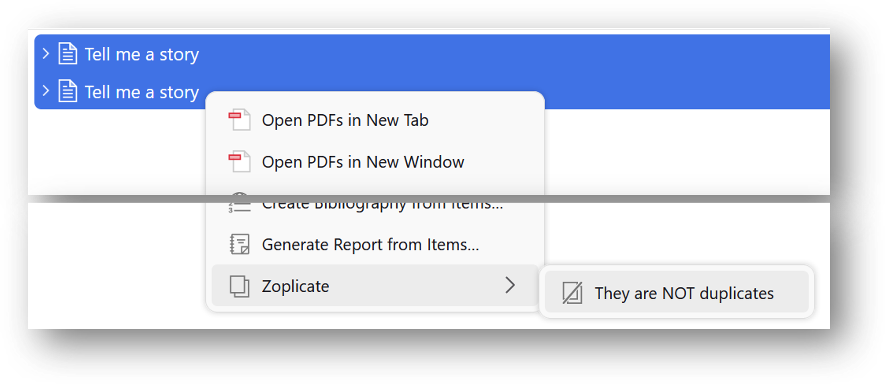
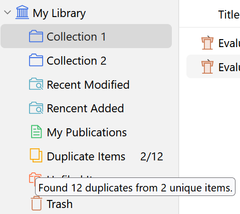
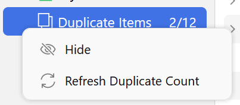
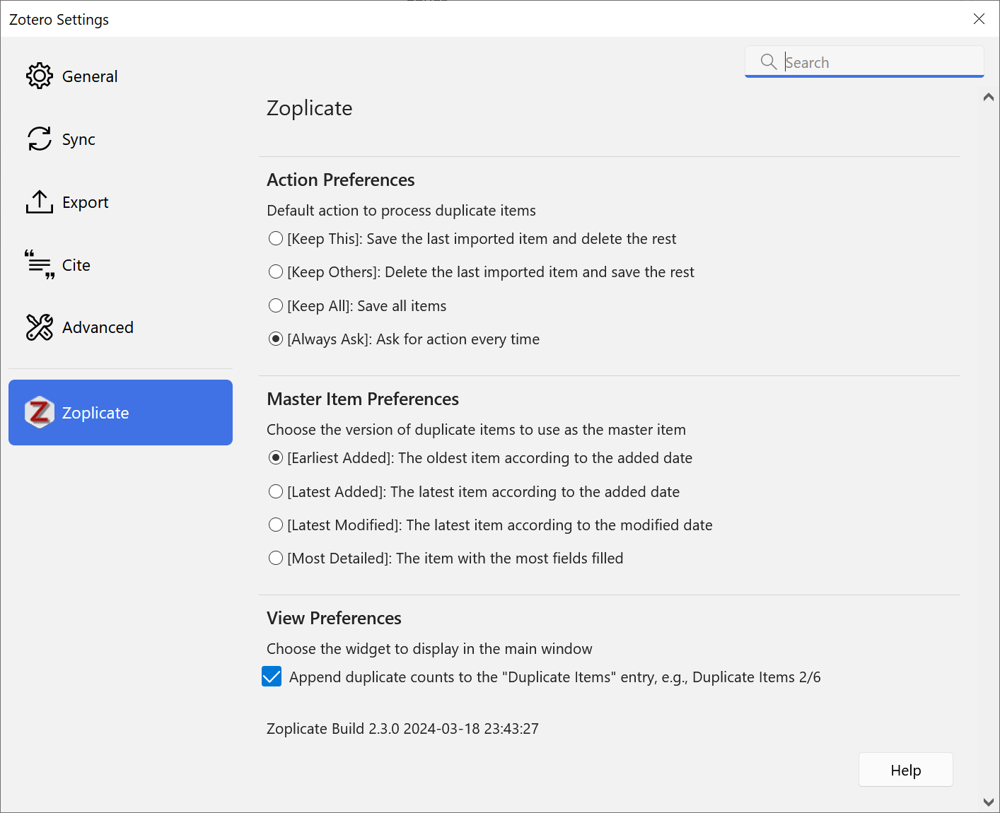
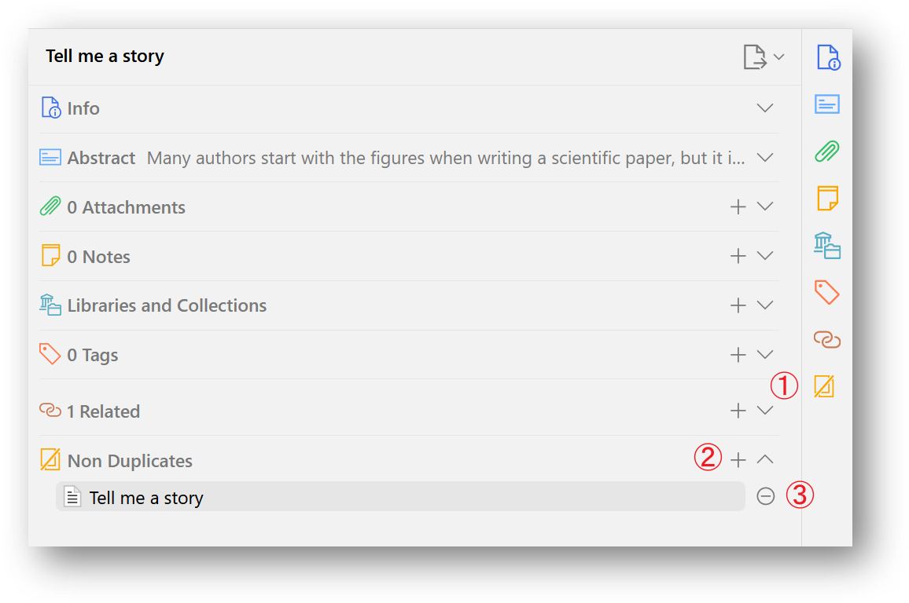
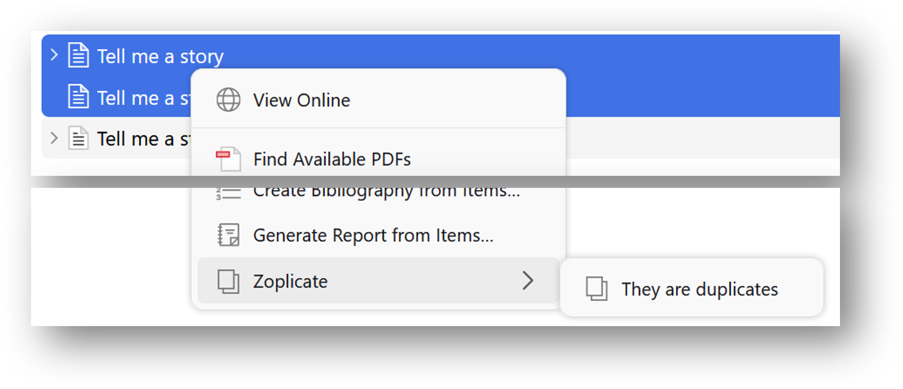

    

👉

👈
👉

👈

----

    English | <a href="./README_CN.md">简体中文</a> | <a href="https://citationstyler.com/wissen/zotero-plugin-zoplicate-einfach-duplikate-erkennen/" target="_blank">Deutsch</a>*

&emsp; _* Many thanks to **Patrick O'Brien** for the German tutorial._

A plugin that does one thing only: **Detect** and **Manage** duplicate items in .

# Main Features

* **Duplicates Detection**
  * Detects if newly imported items are duplicates of existing ones in the Zotero library.
  * You can choose which version of duplicate items to use as the **master item** and **merge** them.
  * The actions you can take:
    1. **Keep New**: Set the **new item** as the master item and merge the duplicates.
    2. **Keep Old**: Set the **existing item** as the master item and merge the duplicates.
    3. **Keep All**: Keep both the new item and the existing item.
    4. **Merge Manually**: Go to the Duplicate Items Panel and merge the duplicate item manually.
* **Auto-Bulk Merge**
  * Merges all duplicate items in the library automatically.
  * Introduced in Version 2.0.0.
* **Non-duplicates Management**
  * Allows marking items as "Non-duplicates" if mistakenly identified as duplicates by Zotero.
  * Introduced in Version 3.0.0.
* **Show Duplicate Statistics**
  * Append the duplicate count on the label of Duplicate Items pane.
  * Introduced in Version 2.3.0.

*If you find this project helpful, please consider [giving it a star](https://github.com/ChenglongMa/zoplicate)* ⭐. *It would be a great encouragement for me!*

> [!IMPORTANT]
> 
> Zoplicate does NOT delete the duplicate items arbitrarily.
> 
> Instead, it extracts the useful information from the duplicate items and merges them into the retained item.
> 
> It makes some improvements based on [the official detection and merging methods of Zotero](https://www.zotero.org/support/duplicate_detection).
>

# Changelog

## v3.0.8

  
<i>Click here to show more.</i>

In this version, we have made the following changes:

1. 🐛 **FIX!**: We have fixed the bug that caused the dialog not to open again when importing duplicate items.
    * Thanks to [pascaloettli](https://github.com/pascaloettli) for reporting this bug in [issue #147](https://github.com/ChenglongMa/zoplicate/issues/147).
    * Thanks to "如梦江南" for reporting this bug on RedNote.
2. 🐛 **FIX!**: We have fixed the dialog styling issue in dark mode.
    * Thanks to [pascaloettli](https://github.com/pascaloettli) for reporting this bug in [issue #146](https://github.com/ChenglongMa/zoplicate/issues/146).

## v3.0.6

  
<i>Click here to show more.</i>

In this version, we have updated the dependencies and adapted to the latest version of Zotero.

Thanks to [pascaloettli](https://github.com/pascaloettli) for the feedback in [issue #131](https://github.com/ChenglongMa/zoplicate/issues/131).

## v3.0.5

  
<i>Click here to show more.</i>

In this version, we have made the following changes:

1. 🐛 **FIX!**: We have fixed the bug that caused the sync error.
    * Thanks to [dstillman](https://github.com/dstillman) for reporting this issue in [issue #124](https://github.com/ChenglongMa/zoplicate/issues/124).
2. 🐛 **FIX!**: We have optimized the UI of context menu.
    * Thanks to [dschaehi](https://github.com/dschaehi) for reporting this issue in [issue #119](https://github.com/ChenglongMa/zoplicate/issues/119).
3. 🐛 **FIX!**: We have optimized the UI styling of bulk merge buttons.
    * Thanks to [vancleve](https://github.com/vancleve) for reporting this issue in [issue #120](https://github.com/ChenglongMa/zoplicate/issues/120).

## v3.0.4

  
<i>Click here to show more.</i>

In this version, we have made the following changes:

1. 🐛 **FIX!**: We have fixed the bug that caused the UI blocked when selecting too many items and opening the context menu.
    * Thanks to [zzlb0224](https://github.com/zzlb0224), [pencilheart](https://github.com/pencilheart) and [dschaehi](https://github.com/dschaehi) for reporting this bug in [issue #94](https://github.com/ChenglongMa/zoplicate/issues/94) and [issue #119](https://github.com/ChenglongMa/zoplicate/issues/119) respectively.
2. 🐛 **FIX!**: We have optimized the plugin lifecycle which may cause the plugin to load multiple preference settings on macOS.
    * Thanks to [WangYe661](https://github.com/WangYe661) and [pencilheart](https://github.com/pencilheart) for reporting this bug in [issue #81](https://github.com/ChenglongMa/zoplicate/issues/81).
3. 🐛 **FIX!**: We have optimized database operations to reduce the risk of data loss.

## v3.0.3

  
<i>Click here to show more.</i>

In this version, we have made the following changes:

1. 🐛 **FIX!**: We have fixed the bug that caused the attachment to be lost when merging duplicate items.
    * Thanks to [tommyhosman](https://github.com/tommyhosman) for reporting this bug in [issue #43](https://github.com/ChenglongMa/zoplicate/issues/43).
    * Thanks to [csdaboluo](https://github.com/csdaboluo) for reporting this bug in [issue #51](https://github.com/ChenglongMa/zoplicate/issues/51).
2. 🐛 **FIX!**: Zoplicate will now ignore the **Feed** items when detecting duplicates.
    * Thanks to [Raphael-Hao](https://github.com/Raphael-Hao) for reporting this bug in [issue #54](https://github.com/ChenglongMa/zoplicate/issues/54).
3. 🐛 **FIX!**: We have fixed the bug that caused the detection dialog blocking the main thread.
4. 🐛 **FIX!**: We have fixed the bug that caused the deleted items to be showing in NonDuplicates panel.
5. 🐛 **FIX!**: Now, the NonDuplicates panel won't show up when clicking attachment items.
6. ✨ **NEW!**: We added a prompt to remind the duplicates when Zotero is in background.

  
<i>Click here to show more.</i>

## v3.0.2

  
<i>Click here to show more.</i>

In this version, we have made the following changes:

1. 🐛 **FIX!**: We have fixed the progress window icon bug in Zotero 7.0.0-beta.77.
2. 🧬 **CHANGE!**: We have updated the style of duplicate detection dialog.
3. 🧬 **CHANGE!**: We have updated the icon style in preference pane.
4. 🧬 **CHANGE!**: Items with different `itemType` will not be considered as duplicates.

## v3.0.1

  
<i>Click here to show more.</i>

In this version, we have made the following changes:

1. 🧬 **CHANGE!**: We have updated the UI of buttons in the duplicate pane.
2. 🐛 **FIX!**: We have optimized the performance of duplicate search and detection.

## v3.0.0

  
<i>Click here to show more.</i>

In this version, we have made the following changes:

1. 🐛 **FIX!**: We have fixed a **memory leak** bug that caused the app to freeze when editing PDF annotations.
   * Thanks [vancleve](https://github.com/vancleve) and [pencilheart](https://github.com/pencilheart) for reporting this bug in [issue #30](https://github.com/ChenglongMa/zoplicate/issues/30) and [issue #31](https://github.com/ChenglongMa/zoplicate/issues/31) respectively.
2. ✨ **NEW!**: We have added the **Non-duplicates** functionality.
   * You can mark items as **Non-duplicates** when they are mistakenly identified as "duplicates" by Zotero.
   * Selecting two "false duplicates", you can find the `They are NOT duplicates` **menu items** in the context menu.
     * 
   * You can also find the `They are NOT duplicates` button in the `Duplicate Items` panel.
     * 
   * For more details, please see [Non-duplicates](#non-duplicates) section below.
   * Thanks [dschaehi](https://github.com/dschaehi) for the discussion in [issue #25](https://github.com/ChenglongMa/zoplicate/issues/25).

## v2.3.0

  
<i>Click here to show more.</i>

In this version, we have made the following changes:

1. ✨ **NEW!**: We have added an option to show the duplicate count on the left collection pane.
   * You can find the option in the `Zoplicate` tab in the settings.
   * When your mouse hovers over the <kbd>Duplicate Items</kbd> entry, a tooltip will show the duplicate statistics.
      
      
   * The duplicate count will be updated automatically. You can also find the <kbd>Refresh Duplicate Count</kbd> menu to update the count manually.
      
     
   * Thanks [Apollo7777777](https://github.com/Apollo7777777)'s idea mentioned in [discussion #18](https://github.com/ChenglongMa/zoplicate/discussions/18)
2. 🐛 **FIX!**: We have fixed a bug that caused the dialog to be too narrow when the title is short.
3. 🐛 **FIX!**: We have fixed a bug that caused the `Bulk Merge` icons to not maintain aspect ratios.

## v2.2.0

  
<i>Click here to show more.</i>

In this version, we have made the following changes:

1. ✨ **NEW!**: We have added **"Smart" Merge** functionality (Only available in Zotero 7 now).
   * When merging duplicate items, the function will fill in the missing information of the retained item with the duplicates.
   * Thanks [endfreude](https://github.com/endfreude)'s idea mentioned in [issue #15](https://github.com/ChenglongMa/zoplicate/issues/15).

## v2.1.0

  
<i>Click here to show more.</i>

In this version, we have made the following changes:

1. ✨ **NEW!**: We have added the **Suspend** and **Restore** functionality (Only available in Zotero 7 now).
   * Please see [Bulk Merge](#bulk-merge) section below for more details.
2. 🧬 **CHANGE!**: We have changed the behavior of **Keep Others** action.
   * Previously, the **Keep Others** action will delete the last imported item and save **ALL** the rest existing items.
   * Now, the action will **Merge** the existing items based on the **Master Item** preferences in [Settings](#settings).
3. 🐛 **FIX!**: We have fixed a bug that caused the **tags** could not be loaded correctly in v2.0.0.
   * Thanks [ChinJCheung](https://github.com/ChinJCheung) for reporting this bug in [issue #10](https://github.com/ChenglongMa/zoplicate/issues/10).

## v2.0.0

  
<i>Click here to show more.</i>

In this version, we have made the following changes:

1. ✨ **NEW!**: We have added the **Bulk Merge** functionality (Only available in Zotero 7 now).
   * **Bulk Merge**: Merge all duplicate items in the library automatically.
   * You can find the **Bulk Merge** button in the `Duplicate Items` panel.
   * Please see [Bulk Merge](#bulk-merge) section below for more details.
   * Thanks [csdaboluo](https://github.com/csdaboluo)'s idea mentioned in [issue #8](https://github.com/ChenglongMa/zoplicate/issues/8).
2. 🐛 **FIX!**: We have fixed a bug that caused the dialog height to be too high when importing duplicate items in bulk.
3. 🐛 **FIX!**: Now Zotero will auto-select the remained item after merging duplicate items.
   * Thanks [pencilheart](https://github.com/pencilheart)'s report in [issue #7](https://github.com/ChenglongMa/zoplicate/issues/7).

## v1.1.0

  
<i>Click here to show more.</i>

In this version, we have made the following changes:

1. 🧬 **CHANGE!**: We have changed the processing method of duplicate items.

   Previously, we use the `Trash` method to process duplicate items, i.e., delete the duplicate items.
   However, this method will cause the loss of some information of the duplicate items.
   * E.g., **notes**, **tags**, **collections**, **attachments**.

   In this version, we use the `Merge` method to process duplicate items.
   This method will copy all the aforementioned information to the retained item, and then delete the duplicate items.
   * **NOTE**: If you are using [ZotFile](http://zotfile.com/), the `Merge` method will copy the **file link** of the duplicate items to the retained item.
   * However, users relying on Zotero's default attachment storage may encounter duplication issues if the newly imported item contains attachments. 
     * This is a known potential problem in Zotero, as detailed in [Zotero Documentation - Duplicate Detection](https://www.zotero.org/support/duplicate_detection).

Thanks [ChinJCheung](https://github.com/ChinJCheung)'s idea mentioned in [issue #5](https://github.com/ChenglongMa/zoplicate/issues/5).

# Install

## From GitHub

1. Download `.xpi` file according to the version of Zotero you are using.
   - **For Zotero 7**: Visit the [release page](https://github.com/ChenglongMa/zoplicate/releases/latest) and download [the latest `.xpi` file](https://github.com/ChenglongMa/zoplicate/releases/latest/download/zoplicate.xpi).
   - **For Zotero 6**: Visit the [release page](https://github.com/ChenglongMa/zoplicate/releases/tag/zotero6) and download [the `.xpi` file for Zotero 6](https://github.com/ChenglongMa/zoplicate/releases/download/zotero6/zoplicate.xpi).
   - If you are using FireFox, right-click on the link of the XPI file and select "Save As...".
2. Then, in Zotero, click `Tools` -> `Plugins` and drag the `.xpi` onto the Plugins window.
   - See [how to install a Zotero addon](https://www.zotero.org/support/plugins).

## From Add-on Market Plugin for Zotero

_Additional third-party plugin is required._

1. Install Add-on Market for Zotero from [here](https://github.com/syt2/zotero-addons).
2. Search `Zoplicate` in the Add-on Market and install it.

## 通过 Zotero 插件商店 安装 (For Chinese Users)

1. 前往 [Zotero 插件商店](https://zotero-chinese.com/plugins/).
2. 搜索 `Zoplicate` 然后单击 `下载` 按钮。

# Usage

## Settings

In Zotero, click `Edit` -> `Settings`, go to `Zoplicate` tab, and you will see the settings.

1. You can select the actions you want to take when duplicate items are detected.
    * `Always Ask` is the default option if you have not changed the settings.
2. You can select the version of duplicate items to use as the **master item**.
    * `Earliest Added` is the default option if you have not changed the settings.

## Duplicate Detection

By default, or you have selected `Always Ask` in the settings,
a dialog will pop up when you import a new item that is a duplicate of an existing item.

The dialog will show the duplicate items and the actions you can take.

1. Select the action you want to take and click <kbd>Apply</kbd> to process the duplicate items.
2. Click <kbd>Go to Duplicates</kbd> to go to the `Duplicate Items` panel and merge the duplicate items manually.
3. Click <kbd>Cancel</kbd> to dismiss the dialog and **save** the import of the new item and the existing items.
4. Check <kbd>Use this action by default</kbd> to remember the selected action in default settings.
   Then the next time you import a duplicate item, the selected action will be applied automatically.

### Multiple Duplicate Items

When you import multiple duplicate items,
or import another duplicate item before you process the previous duplicate items,
the dialog will show all the duplicate items and the actions you can take.

1. You can select different actions for different duplicate items.
2. Click the _header_ of action columns to select the same action for all duplicate items.
3. <kbd>Use this action by default</kbd> option will be shown only when you select the same action for all duplicate items.

## Bulk Merge

Inspired by [csdaboluo](https://github.com/csdaboluo)'s idea and [ZoteroDuplicatesMerger](https://github.com/frangoud/ZoteroDuplicatesMerger),
we have added the **Bulk Merge** functionality in **Version 2.0.0**.

In the `Duplicate Items` panel, you can find the <kbd>Bulk Merge All Duplicate Items</kbd> button:

You can also find it when you select one or more duplicate items:

> [!WARNING]  
> 
> 1. Before clicking the button, please make sure you have properly configured the _Master Item_ preferences in [Settings](#settings).
> 2. The **Bulk Merge** functionality will **take a while** to complete if you have a large number of duplicate items.
> 3. This functionality is only available in Zotero 7 now. I will check compatibility and try to migrate to Zotero 6.

You will see the progress of the bulk merge process:

### Suspend Bulk Merge

You can click the <kbd>Suspend</kbd> button to suspend the bulk merge process.

A dialog will pop up to confirm your action:

1. Click <kbd>Resume</kbd> to **resume** the bulk merge process.
2. Click <kbd>Cancel</kbd> to **cancel** the bulk merge process.
   * Check <kbd>Restore Deleted Items</kbd> to restore the duplicate items that have been merged.
   * Note that the **Restore** action is only effective if you click <kbd>Cancel</kbd>. 

> [!TIP]
>
> If you want to **Restore** the duplicate items that have been merged, 
> you can go to `Trash` panel and restore them.
> 
> 1. Select the duplicate items you want to restore.
> 2. Click <kbd>Restore to Library</kbd> button to process.

## Show Duplicate Statistics

Starting from **Version 2.3.0**, we have added an option to show the duplicate count on the left collection pane.

You can find the option in the `Zoplicate` tab in [the settings](#settings).

When your mouse hovers over the <kbd>Duplicate Items</kbd> entry, a tooltip will show the duplicate statistics.

The duplicate count will be updated automatically. You can also find the <kbd>Refresh</kbd> menu to update the count manually.

## Non-duplicates

Starting from **Version 3.0.0**, we have added the **Non-duplicates** functionality.

You can mark items as **Non-duplicates** when they are mistakenly identified as "duplicates" by Zotero.

Selecting an item, you can manage the **Non-duplicates** items in the side panel:

* Click the <kbd></kbd> button to show the **Non-duplicates** section.
* Click the <kbd>+</kbd> button to add the selected item to the **Non-duplicates** list.
* Click the <kbd>-</kbd> button to remove the selected entry from the **Non-duplicates** list.

There are some ways to mark and unmark items as **Non-duplicates**:

### Mark as Non-duplicates

1. Click the <kbd>+</kbd> button to add the selected item to the **Non-duplicates** list.
2. Selecting two "false duplicates", you can find the `They are NOT duplicates` **menu items** in the context menu.
   * 
3. You can also find the `They are NOT duplicates` button in the `Duplicate Items` panel.
   * 

### Unmark as Non-duplicates

1. Click the <kbd>-</kbd> button to remove the selected entry from the **Non-duplicates** list.
2. Selecting two "non duplicates", you can find the `They are duplicates` **menu items** in the context menu.
   * 

# Contributing

👋 Welcome to **Zoplicate**! We're excited to have your contributions. Here's how you can get involved:

1. 💡 **Discuss New Ideas**: Have a creative idea or suggestion? Start a discussion in
   the [Discussions](https://github.com/ChenglongMa/zoplicate/discussions) tab to share your thoughts and
   gather feedback from the community.

2. ❓ **Ask Questions**: Got questions or need clarification on something in the repository? Feel free to open
   an [Issue](https://github.com/ChenglongMa/zoplicate/issues) labeled as a "question" or participate
   in [Discussions](https://github.com/ChenglongMa/zoplicate/discussions).

3. 🐛 **Issue a Bug**: If you've identified a bug or an issue with the code, please open a
   new [Issue](https://github.com/ChenglongMa/zoplicate/issues) with a clear description of the problem, steps
   to reproduce it, and your environment details.

4. ✨ **Introduce New Features**: Want to add a new feature or enhancement to the project? Fork the repository, create a
   new branch, and submit a [Pull Request](https://github.com/ChenglongMa/zoplicate/pulls) with your changes.
   Make sure to follow our contribution guidelines.

5. 💖 **Funding**: If you'd like to financially support the project, you can do so
   by [sponsoring the repository on GitHub](https://github.com/sponsors/ChenglongMa). Your contributions help us
   maintain and improve the project.

# Acknowledgements

I would like to express my gratitude to the following individuals and organizations for their generous support and contributions to this project:

## Sponsors

 
    <a href="https://github.com/quinn-p-mchugh" aria-label="Sponsor Quinn McHugh" style="display: inline-block; margin: 10px;"> 
         
         
        Quinn McHugh
    </a>
    <a href="https://github.com/Mctalos" aria-label="Sponsor Mctalos" style="display: inline-block; margin: 10px;"> 
        
         
        Mctalos
    </a> 

Usually, a ⭐️ is enough to make me happy. Your sponsorship will help me maintain and improve the project. 
Also, part of the sponsorship will be donated to the open-source community.

Thank you for considering contributing to **Zoplicate**. We value your input and look forward to collaborating
with you!
