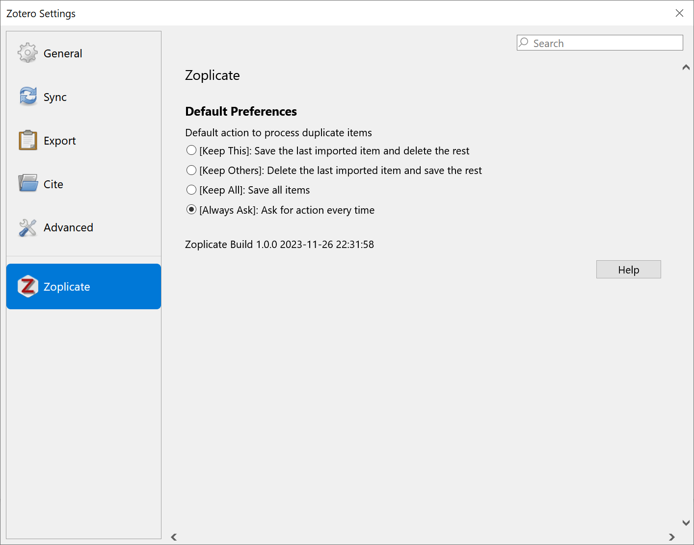

    

    
💤

💤

💤
    

    

----

A plugin that does one thing only: **Detect** and **Manage** duplicate items in .

The plugin can detect if the newly imported item is a duplicate of an existing item in the library.
If so, it will prompt you to process the duplicate items.

The actions you can take are:

1. **Keep This**: Save the last imported item and delete the rest.
2. **Keep Others**: Delete the last imported item and save the rest.
3. **Keep All**: Keep both the new item and the existing item.
4. **Merge Manually**: Go to Duplicate Panel and merge the duplicate item manually.

*If you find this project helpful, please consider giving it a star* ⭐. *It would be a great encouragement for me!*

# Install

1. Download `.xpi` file according to the version of Zotero you are using.
   - **For Zotero 7**: Visit the [release page](https://github.com/ChenglongMa/zoplicate/releases/latest) and download [the latest `.xpi` file](https://github.com/ChenglongMa/zoplicate/releases/latest/download/zoplicate.xpi).
   - **For Zotero 6**: Visit the [release page](https://github.com/ChenglongMa/zoplicate/releases/tag/zotero6) and download [the `.xpi` file for Zotero 6](https://github.com/ChenglongMa/zoplicate/releases/download/zotero6/zoplicate.xpi).
   - If you are using FireFox, right-click on the link of the XPI file and select "Save As...".
2. Then, in Zotero, click `Tools` -> `Add-ons` and drag the `.xpi` onto the Add-ons window.
   See [how to install a Zotero addon](https://www.zotero.org/support/plugins).

# Usage

## Default Settings

In Zotero, click `Edit` -> `Settings`, go to `Zoplicate` tab, and you will see the default settings.

You can select the actions you want to take when duplicate items are detected.
`Always Ask` is the default option if you have not changed the settings.

## Duplicate Dialog

By default, or you have selected `Always Ask` in the settings,
a dialog will pop up when you import a new item that is a duplicate of an existing item.

The dialog will show the duplicate items and the actions you can take.

1. Select the action you want to take and click <kbd>Apply</kbd> to process the duplicate items.
2. Click <kbd>Go to Duplicates</kbd> to go to the `Duplicate Panel` and merge the duplicate items manually.
3. Click <kbd>Cancel</kbd> to dismiss the dialog and **save** the import of the new item and the existing items.
4. Check <kbd>Use this action by default</kbd> to remember the selected action in default settings.
   Then the next time you import a duplicate item, the selected action will be applied automatically.

### Multiple Duplicate Items

When you import multiple duplicate items,
or import another duplicate item before you process the previous duplicate items,
the dialog will show all the duplicate items and the actions you can take.

1. You can select different actions for different duplicate items.
2. Click the _header_ of action columns to select the same action for all duplicate items.
3. <kbd>Use this action by default</kbd> option will be shown only when you select the same action for all duplicate items.

# Contributing

👋 Welcome to **Zoplicate**! We're excited to have your contributions. Here's how you can get involved:

1. 💡 **Discuss New Ideas**: Have a creative idea or suggestion? Start a discussion in
   the [Discussions](https://github.com/ChenglongMa/zoplicate/discussions) tab to share your thoughts and
   gather feedback from the community.

2. ❓ **Ask Questions**: Got questions or need clarification on something in the repository? Feel free to open
   an [Issue](https://github.com/ChenglongMa/zoplicate/issues) labeled as a "question" or participate
   in [Discussions](https://github.com/ChenglongMa/zoplicate/discussions).

3. 🐛 **Issue a Bug**: If you've identified a bug or an issue with the code, please open a
   new [Issue](https://github.com/ChenglongMa/zoplicate/issues) with a clear description of the problem, steps
   to reproduce it, and your environment details.

4. ✨ **Introduce New Features**: Want to add a new feature or enhancement to the project? Fork the repository, create a
   new branch, and submit a [Pull Request](https://github.com/ChenglongMa/zoplicate/pulls) with your changes.
   Make sure to follow our contribution guidelines.

5. 💖 **Funding**: If you'd like to financially support the project, you can do so
   by [sponsoring the repository on GitHub](https://github.com/sponsors/ChenglongMa). Your contributions help us
   maintain and improve the project.

Thank you for considering contributing to **Zoplicate**. We value your input and look forward to collaborating
with you!
