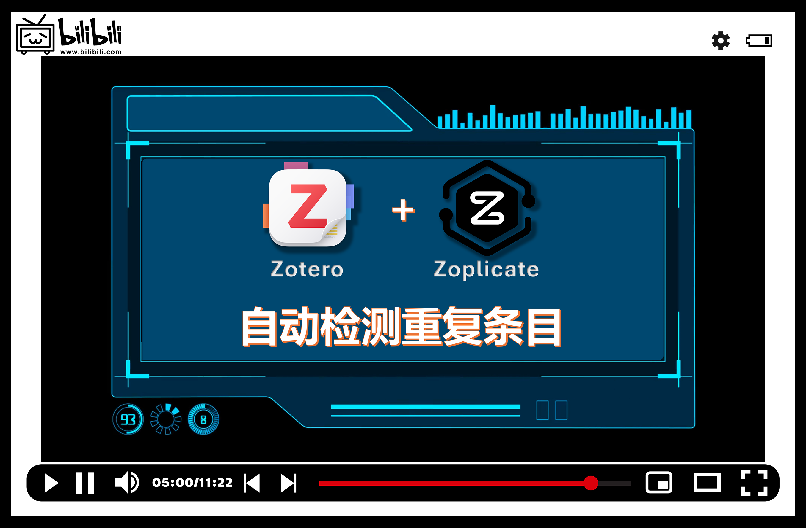

    

👉

👈
👉

👈

----

    <a href="./README.md">English</a> | 简体中文

Zoplicate 是一个用于  的插件，它只专注一件事：**检测和管理重复的文献条目**。

# 主要功能

- **检测重复条目**：
  * 自动检测新添加的文献条目是否与已有条目重复。
  * 你可以选择**主条目**的版本，然后将重复条目**合并**到主条目中。
  * 支持的操作有：
    * **保留最新的**：以**新导入**条目为主条目，合并重复条目。
    * **保留已有的**：以**已有**条目为主条目，合并重复条目。
    * **保留全部**：保留所有条目，不合并任何项。
    * **手动合并**：前往 "重复条目" 面板，手动选择要合并的条目。
- **批量处理重复条目**：
  * 你可以在 "重复条目" 面板中，批量合并多个重复条目。
  * 你可以在设置中选择**主条目**的版本。
- **标记"非重复条目"**
  * 如果你认为某些条目不是重复的，你可以将其标记为"非重复条目"。
- **显示重复条目统计信息**
  * 你可以设置在"重复条目"标签后显示重复条目数量。如，重复条目 2/6。

_如果你觉得这个插件对你有帮助，欢迎给它一个 ⭐️。感谢你的支持！_

> [!IMPORTANT]
>
> Zoplicate 不会单纯地**删除**重复的条目。
>
> 相反，它会从重复的条目中提取有用的信息，并将其合并到保留的条目中。
>
> 它在 [Zotero 官方的重复检测和合并方法](https://www.zotero.org/support/duplicate_detection) 的基础上做了一些改进。
>

# 视频教程

# 安装

## 通过 GitHub 安装

1. 根据你的 Zotero 版本，下载最新的 `zoplicate.xpi` 文件：
   - **Zotero 7**：从该 [release page](https://github.com/ChenglongMa/zoplicate/releases/latest) 中下载 [最新的 `.xpi` 文件](https://github.com/ChenglongMa/zoplicate/releases/latest/download/zoplicate.xpi)。
   - **Zotero 6**：从该 [release page](https://github.com/ChenglongMa/zoplicate/releases/tag/zotero6) 中下载 [Zotero 6 版本的 `.xpi` 文件](https://github.com/ChenglongMa/zoplicate/releases/download/zotero6/zoplicate.xpi).
2. 打开 Zotero，然后前往 `工具` -> `插件`。选择 `从文件安装插件...`。
   * 详情请参考 [Zotero 官方文档](https://www.zotero.org/support/plugins)。

## 通过 Add-on Market Plugin for Zotero 安装

_需要安装额外的第三方插件。_

1. 单击 [这里](https://github.com/syt2/zotero-addons) 安装 Add-on Market Plugin for Zotero 插件。
2. 在 Add-on Market 中搜索 `Zoplicate` 并安装。

## 通过 Zotero 插件商店 安装

1. 前往 [Zotero 插件商店](https://zotero-chinese.com/plugins/).
2. 搜索 `Zoplicate` 然后单击 `下载` 按钮。

# 使用方法

## 设置

打开 Zotero，然后前往 `编辑` -> `设置`。单击 `Zoplicate` 选项卡，你会看到如下设置：

   
   
1. 当检测到重复条目时，默认会弹出对话框询问你如何处理。你可以选择是否**自动合并**重复条目。
   * 默认选项为 `始终询问`。
2. 你可以选择批量合并时**主条目**的版本。
   * 默认选项为 `最早添加的`。 
3. 你可以选择是否在 "重复条目" 标签后显示重复条目数量。

## 检测重复条目

默认情况下，当添加新的文献条目时，Zoplicate 会自动检测是否有重复的条目。如果有，你会看到如下对话框：

   

该对话框会显示所有重复的条目和你可以选择的操作。

1. 选择你要执行的操作，然后单击 <kbd>应用</kbd> 来合并重复条目。
2. 单击 <kbd>手动合并</kbd> 将打开 "重复条目" 面板，你可以在那里手动选择要合并的条目。
3. 单击 <kbd>取消</kbd> 将关闭对话框并保存所有条目。
4. 勾选 <kbd>将此操作设为默认值</kbd> 将记住你的选择，下次将自动执行该操作而不再弹出对话框。

### 检测到多个重复条目

当引入多个重复条目或在处理之前的重复条目之前引入另一个重复条目时，对话框将显示所有重复条目和你可以采取的操作。

1. 你可以为不同的重复条目选择不同的操作。
2. 单击选项的列头将会应用该操作到所有重复条目。
3. <kbd>将此操作设为默认值</kbd> 只有在所有重复条目都选择了相同的操作时才可用。

## 批量处理重复条目

在 2.0.0 版本中，Zoplicate 引入了 "批量合并" 功能。

你可以在 "重复条目" 面板中找到 <kbd>批量合并所有重复条目</kbd> 按钮：

或当你选择了一个或多个重复条目时：

> [!WARNING]
>
> 1. 在点击按钮之前，请确保你已经在 [设置](#设置) 中正确配置了**主条目**的偏好设置。
> 2. **批量合并** 功能将比较耗时。如果你有大量的重复条目，这个过程可能会花费一些时间。
> 

你可以在 "重复条目" 面板中看到合并的进度：

### 中止批量合并

如果你想中止批量合并，你可以单击 <kbd>暂停合并</kbd> 按钮。

此时会弹出确认对话框：

1. 单击 <kbd>继续</kbd> 将继续合并剩余的重复条目。
2. 单击 <kbd>取消</kbd> 将停止合并并保留已合并的条目。
   * 如果勾选了 <kbd>恢复已删除的条目</kbd>，已合并的条目将被恢复。
   * 请注意 <kbd>恢复已删除的条目</kbd> 选项只在**取消**合并时可用。

> [!TIP]
>
> 如果你想**恢复**已合并的重复条目，你可以前往 `回收站` 面板并将它们恢复。
> 
> 1. 选择你想要恢复的重复条目。
> 2. 单击 <kbd>恢复到库</kbd> 按钮来处理。
> 

## 显示重复条目统计信息

你可以在[设置](#设置)中选择是否在 "重复条目" 标签后显示重复条目数量。

启用后，当鼠标悬停在 "重复条目" 标签上时，你会看到详细的重复条目数量。

该信息会自动更新，你也可以右键单击 <kbd>刷新</kbd> 来手动更新。

## "非重复条目" 管理

如果你认为某些条目不是重复的，你可以将其标记为"非重复条目"。

在条目的侧边栏中，你可以管理这些 **非重复条目**：

* 单击 <kbd></kbd> 按钮将显示 **非重复条目** 面板。
* 单击 <kbd>+</kbd> 按钮可以选择一个条目并将其标记为 **非重复条目**。
* 单击 <kbd>-</kbd> 按钮可以取消 **非重复条目** 标记。

当然，还有以下几种方式可以标记或取消标记 **非重复条目**：

### 标记 "非重复条目"

1. 如前所述，你可以在侧边栏<kbd></kbd> 中单击 <kbd>+</kbd> 按钮来标记 **非重复条目**。
2. 你可以在条目的右键菜单中选择 <kbd>标记为非重复条目</kbd> 来标记 **非重复条目**。
   * 该选项只有在选择的条目**被 Zotero 误认为是重复条目**时才会显示。
   * 
3. 你可以在 "重复条目" 面板中选择多个条目，然后单击 <kbd>标记为非重复条目</kbd> 按钮来标记 **非重复条目**。
   * 

### 取消标记 "非重复条目"

1. 你可以在侧边栏<kbd></kbd> 中单击 <kbd>-</kbd> 按钮来取消标记 **非重复条目**。
2. 你可以在条目的右键菜单中选择 <kbd>取消标记为非重复条目</kbd> 来取消标记 **非重复条目**。
   * 该选项只有在选择的条目**被标记为非重复条目后**才会显示。
   * 

# 开源贡献

👋 欢迎关注 **Zoplicate**！很高兴有你的参与。以下是你可以参与的方式：

1. 💡 **讨论新想法**：有创意的想法或建议？在[Discussion](https://github.com/ChenglongMa/Zoplicate/discussions)页面开始讨论，分享你的想法并从获得反馈。

2. ❓ **提问**：对仓库中的某些内容有疑问？随时开一个标记为“问题”的[issue](https://github.com/ChenglongMa/Zoplicate/issues)或参与[Discussion](https://github.com/ChenglongMa/Zoplicate/discussions)。

3. 🐛 **报告错误**：如果你发现了一个bug，请开一个新的[issue](https://github.com/ChenglongMa/Zoplicate/issues)，并清楚描述问题、复现步骤以及你的运行环境。

4. ✨ **引入新功能**：想要为项目添加新功能或增强吗？Fork仓库，创建一个新分支，并提交一个带有你更改的[PR](https://github.com/ChenglongMa/Zoplicate/pulls)。确保遵循我们的贡献指南。

5. 💖 **赞助**：如果您想更多地支持该项目，你可以通过[在GitHub上赞助仓库](https://github.com/sponsors/ChenglongMa)来实现。感谢各位金主大佬！

非常感谢各位对 **Zoplicate** 的关注和支持！🙏
